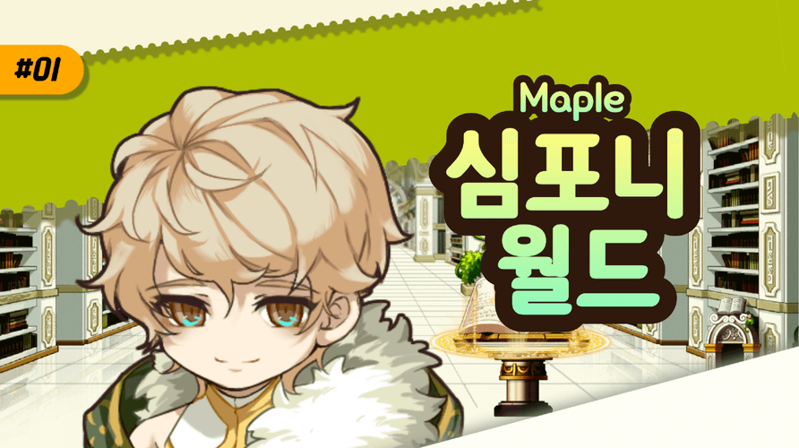

# 한 줄 소개
안녕하세요    
   
**궁극적 재미**를 추구하는 **게임 개발자 오윤진**입니다.   
   
끈질기게 붙잡고, **배우는 자세**로 임하겠습니다 감사합니다.
    
# 프로젝트
[1. Pa!nt](#Paint)   
[2. W!P](#WiP)   
[3. 메이플 심포니 월드](#메이플-심포니-월드)   
[4. BCI VR Horror Attraction: The Mad Trail](#BCI-VR-Horror-Attraction-The-Mad-Trail)   

## Paint
  
> 장르 : 퍼즐 플랫포머 게임   
> 엔진 : Unity   
> 플랫폼 : Play Store(OBT 운영), Steam   
> 링크 : [Steam Link](https://store.steampowered.com/app/2516270/Pant/?l=koreana)   
> 다운로드 수 (통합) : ***4.8만 이상***

### 게임 소개   
같은 색은 통과하고, 다른 색은 부딪히는 규칙을 이용하는 퍼즐 플랫포머 게임입니다.   
   
10개 이상의 게임 기믹이 있으며 총 110개의 스테이지로 개발이 완료 되었습니다.   
   
80여 개 이상의 유저 맵이 공유 되었습니다.   

### 기여 부분
#### 클라이언트개발
- Undo 기능 (상태 저장 및 직전 상황 복구 시스템 구현)   
- 게임 업적 획득 시스템   
- 아이템, 기믹 개발   
- 캐릭터 스킨 시스템
- Google Admob 연결   
- 메모리 최적화   
  
#### 개발 외
- 아이템, 기믹 기획   
- 퍼즐 맵 제작
  
#### SteamWorks 
- 버전 관리 진행   
- 유저 소통 및 버그 리포트 작성
  
#### 유저데이터수집
- Unity Analytics 를 활용하여 데이터 수집   
- 이탈 지점 확인 후 UX 개편   

## WiP
</img> 
> 장르 : 퍼즐 캐주얼 게임   
> 엔진 : Unity   
> 플랫폼 : 미출시 (모바일)   
> 링크 :    

### 게임 소개   

같은 색은 통과하고, 다른 색은 부딪히는 규칙으로 목적지까지 이동하는 캐주얼 퍼즐 게임입니다.   
   
무한 모드와 아케이드 모드로 나누어져 있습니다. 무한 모드에서는 시간이 모두 소모되면 게임이 종료됩니다.   
   
아케이드 모드에서는 최소 이동 횟수로 이동해야만 스테이지를 성공할 수 있습니다.​

아케이드 모드로 1000개의 스테이지가 준비되어 있습니다.​ 

### 기여 부분
#### 클라이언트개발
- 게임 튜토리얼 제작   
- Google Admob 연동   
- UI 구성

#### 공모전 지원
- 2023 SUPERCENT x TikTok 하이퍼 캐주얼 게임 챌린지 지원
  
## 메이플 심포니 월드
</img>
> 장르 : 리듬 플랫포머 게임   
> 엔진 : 메이플스토리 월드    
> 플랫폼 : 메이플스토리 월드   
> 링크 : [심포니월드](https://maplestoryworlds.nexon.com/ko/play/2c89a498317848aab9fe46cd70bf74bb/)   

### 게임 소개   

메이플 스토리 월드 Developer Wings 2022에 출품한 리듬게임입니다   
   
메이플 스토리 BGM을 활용하였습니다.   
   
Lua 언어를 활용하여 메이플스토리 월드에서 제작이 되었습니다.   

### 기여 부분
#### 클라이언트개발
- 캐릭터 이동 연출 제작   
- 스테이지 제작   
- 튜토리얼 제작   
- 점수 산정 시스템 구현   

## BCI VR Horror Attraction: The Mad Trail
</img>
> 장르 : 공포 게임   
> 엔진 : Unity    
> 플랫폼 : Steam   
> 링크 : [Steam Link](https://store.steampowered.com/app/1988810/BCI_VR_Horror_Attraction_The_Mad_Trail/?l=koreana)   

### 게임 소개   

뇌파를 활용한 콘텐츠로, 뇌파를 수치화하여 공포 게임에 적용한 VR 게임입니다.   

게임성은 간단하지만 3D 오브젝트를 이용한 연출을 중점으로 두었습니다. 

Unity의 Cinemachine 기능인 Dolly Track을 주기능으로 사용하였습니다. 

### 기여 부분
#### 클라이언트개발
- 3D 캐릭터를 활용한 다양한 연출 제작   
- Steam VR sdk를 활용하여 VR Vive pro 연결   
- 점수 산정 시스템 구현   

# 블로그
[블로그 링크[Velog]](https://velog.io/@ohbangill/posts)

